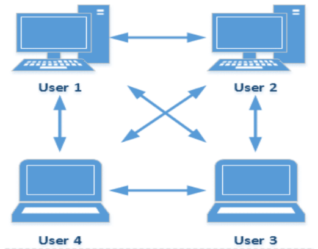
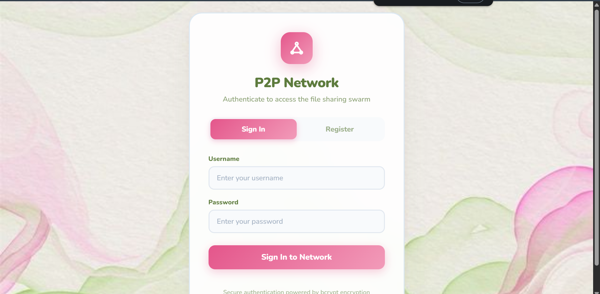
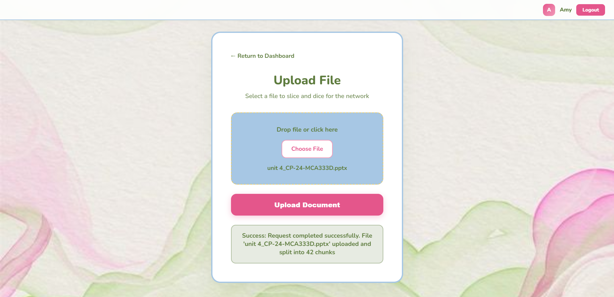
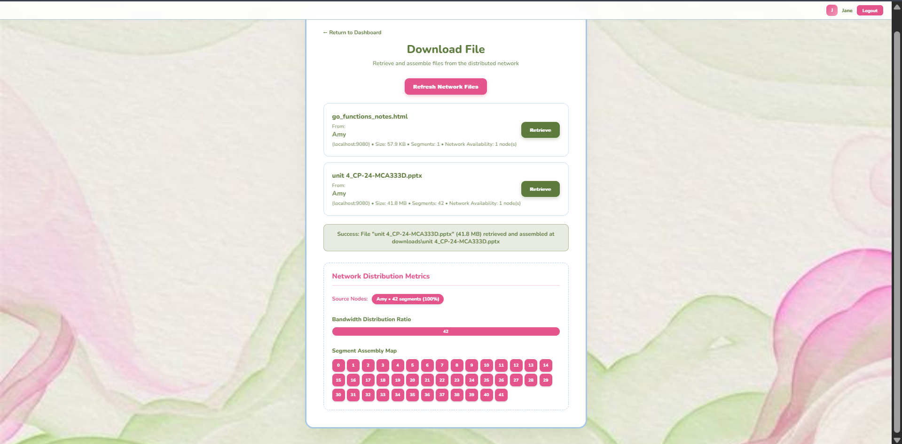
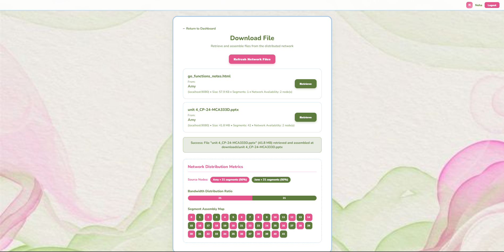

<div align="center">

  # P2P File Sharing System
  
  **A BitTorrent-inspired peer-to-peer file sharing simulation built in Go.**
  
  [](https://go.dev/)
</div>

---

## 📖 Overview & Inspiration

This project is a decentralized **Peer-to-Peer (P2P) file sharing simulation** heavily inspired by the core mechanics of the **BitTorrent** protocol. 

Unlike traditional client-server models, this system has no central server dictating file distribution. Every instance of the application acts as an independent "peer" (both client and server). When a file is uploaded to the swarm, it is divided into fixed-size chunks, hashed for integrity, and distributed across the network. When downloading, a peer requests chunks from multiple connected nodes simultaneously, maximizing bandwidth and demonstrating core distributed systems concepts in action.

  

---

## ✨ Key Features

- **Decentralized Architecture:** True P2P networking where peers discover, register, and communicate with each other directly.
- **Chunk-Based File Transfer:** Files are split into fixed-size byte chunks before transmission to enable distributed, piecemeal sharing.
- **Concurrent Downloads:** Utilizes Go's powerful concurrency primitives (goroutines and channels) to download multiple chunks from different peers in parallel.
- **Data Integrity:** Each chunk is cryptographically hashed to ensure payloads are not corrupted or tampered with during transit.
- **Smart Load Balancing:** Network load is distributed quickly across all available peers holding the required chunks.
- **Secure Authentication:** Built-in user login system utilizing `bcrypt` password hashing and secure session tokens.
- **Resilient Reconstruction:** Chunks are acquired out-of-order and seamlessly reconstructed into the final file locally.

---

## 📸 Screenshots

Here is a look at the web interface and features in action:

<details>
<summary><b>1. User Authentication (Login/Register)</b></summary>
<br>

</details>

<details>
<summary><b>2. Uploading Files to the Swarm</b></summary>
<br>

</details>

<details>
<summary><b>3. Viewing and Downloading Shared Files</b></summary>
<br>

</details>

<details>
<summary><b>4. Concurrent Load Balancing in Action</b></summary>
<br>

</details>

---

## ⚙️ How It Works

The lifecycle of a file in the P2P network follows these core steps:

1. **Upload Phase**
   A user selects a file via the web frontend. The backend reads the file as a byte stream and splits it into fixed-size blocks (chunks). A unique cryptographic hash is generated for each chunk.
2. **Peer Registration & Discovery**
   Each time a node spins up, it registers itself with other known nodes, sharing its address, port, and a catalog of files it currently holds.
3. **Distribution**
   The network continually iterates over connected peers, gossiping chunk data so that redundancy is established across the overlay network.
4. **Concurrent Download**
   When a node requests a file, it queries the network for chunk availability. It then spawns multiple Goroutines to pull different chunks concurrently from various peers.
5. **Reconstruction**
   Once all constituent chunks are acquired and their hashes verified, the blocks are perfectly stitched back together sequentially to rebuild the original file.

---

## 🏗️ Architecture Stack

```text
p2p-server/
├── main.go               # Entry point, CLI flags, and HTTP listener
├── peer/                 # Peer identity, registration, network discovery
├── file/                 # File operations (splitting, metadata, reconstruction)
├── chunk/                # Chunk definition and cryptographic hash verification
├── transport/            # Peer communication logic (HTTP/TCP implementations)
├── auth/                 # Secure user authentication and session management
├── handler/              # HTTP Request handlers and controllers
└── web/                  # HTML/CSS/JS frontend assets
```

---

## 🚀 Getting Started

### Prerequisites

- [Go 1.21+](https://go.dev/dl/) installed locally.
- A modern web browser.

### Running a Local Network Simulation

To see the P2P distribution in action, you should spin up multiple peers locally:

```bash
# 1. Clone the repository
git clone https://github.com/your-username/P2P-Server.git
cd P2P-Server-mod

# 2. Run the first peer (Alpha node) on port 8080
go run main.go --port 8080

# 3. Open a second terminal and run a new peer on port 8081
go run main.go --port 8081

# 4. Open a third terminal and run another peer on port 8082
go run main.go --port 8082
```

Navigate to `http://localhost:8080` in your browser. Upload a file on the first node, switch to `http://localhost:8081`, and download it to watch the swarm orchestrate the transfer!

---

## 📡 API Endpoints

The system exposes a RESTful interface for peer-to-peer communication and frontend interactions:

| Method | Endpoint | Description |
|---|---|---|
| `POST` | `/api/upload` | Upload a file and split it into chunks |
| `GET` | `/api/peers` | List all actively connected peers in the local registry |
| `POST` | `/api/register` | Discover and register a new peer in the swarm |
| `GET` | `/api/download/:fileID`| Download and perfectly reconstruct a shared file |
| `POST` | `/auth/login` | Authenticate a user to join the network |

---

## 📝 Design Notes

- **Simulation Bounds:** This is a programmatic architectural simulation of BitTorrent. It does not perfectly implement legacy Trackers, `.torrent` metadata files, or a Distributed Hash Table (DHT).
- **Network Scope:** In its default configuration, peers communicate primarily via Localhost or LAN. Cloud deployments require configured public IPs/Ports.
- **Configurability:** Chunk sizes, networking protocols, authentication requirements, and peer timeouts can be tweaked within the source code (`main.go`).
