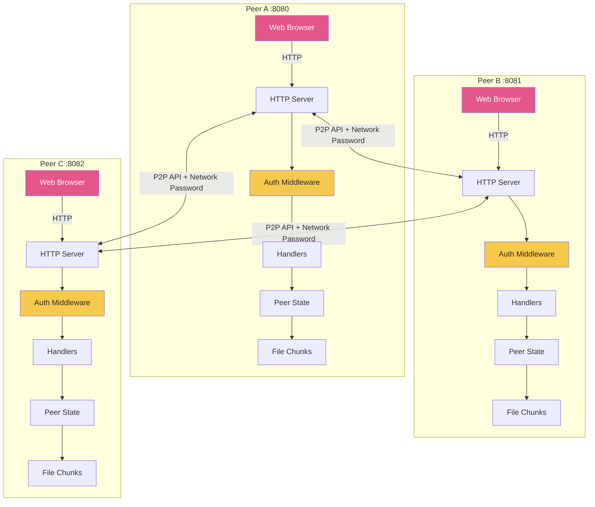
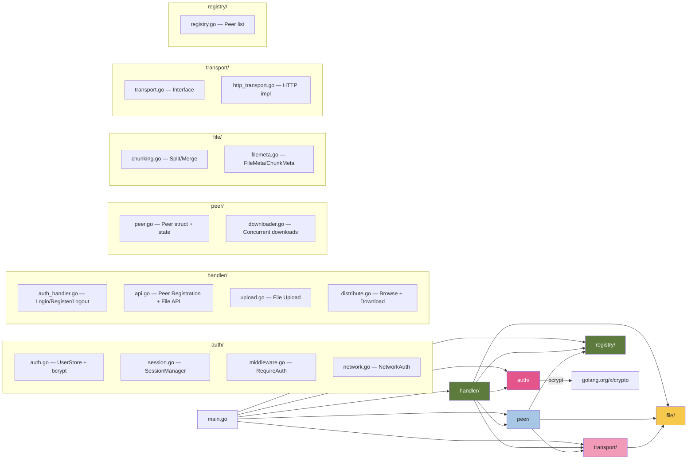
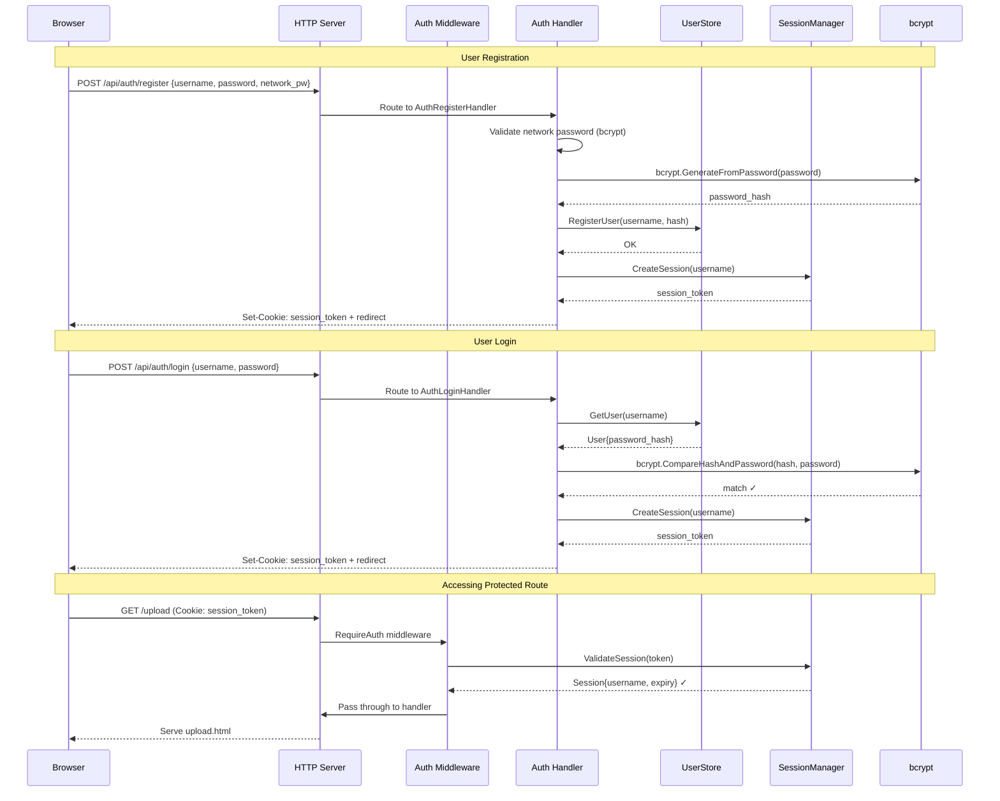
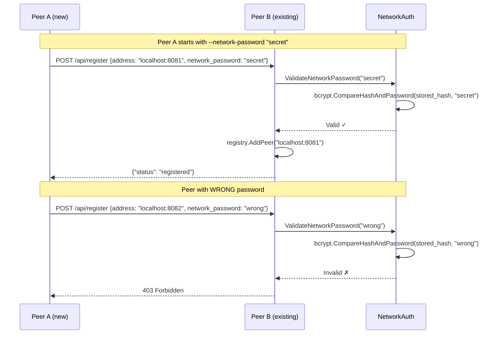
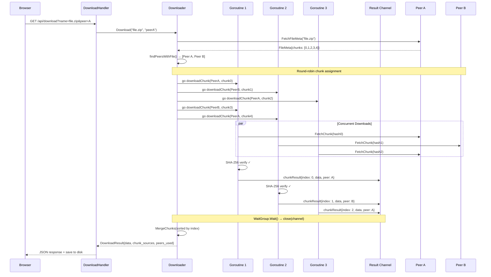
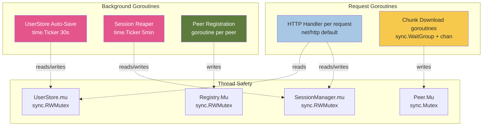
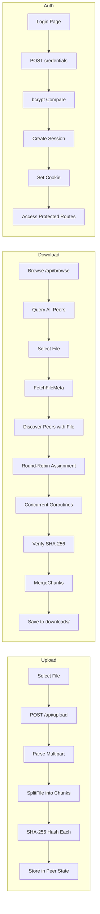

# P2P File Sharing System — Architecture & Design

## 1. System Overview

The P2P File Sharing System is a distributed application where each peer acts as both a client and server. Files are split into chunks, distributed across peers, and reassembled on download. Authentication is enforced at two levels: user login via web UI and network-level password for peer joining.

---

## 2. Package Architecture

---

## 3. Authentication Flow

---

## 4. Peer Registration Flow (Network Password)

---

## 5. Concurrent File Download Flow

---

## 6. Concurrency Model

---

## 7. HTTP Route Map

| Method | Route | Auth | Handler | Purpose |
|--------|-------|------|---------|---------|
| GET | `/login` | ✗ | `LoginPageHandler` | Serve login page |
| POST | `/api/auth/login` | ✗ | `AuthLoginHandler` | Authenticate user (bcrypt) |
| POST | `/api/auth/register` | ✗ | `AuthRegisterHandler` | Register new user |
| POST | `/api/auth/logout` | ✗ | `AuthLogoutHandler` | Destroy session |
| GET | `/api/auth/status` | ✗ | `AuthStatusHandler` | Get current user info |
| GET | `/` | ✓ | Serve `home.html` | Dashboard page |
| GET | `/upload` | ✓ | Serve `upload.html` | Upload page |
| GET | `/download` | ✓ | `DownloadPageHandler` | Download page |
| POST | `/api/upload` | ✓ | `UploadHandler` | Upload & chunk file |
| GET | `/api/browse` | ✓ | `BrowseFilesHandler` | List network files |
| GET | `/api/download` | ✓ | `DownloadHandler` | Download & reassemble |
| POST | `/api/register` | Network PW | `RegisterPeerHandler` | Peer registration |
| GET | `/api/files` | ✗ | `FileListHandler` | List local files (P2P) |
| GET | `/api/filemeta` | ✗ | `FileMetaHandler` | File metadata (P2P) |
| GET | `/api/chunk` | ✗ | `ChunkHandler` | Serve chunk data (P2P) |
| GET | `/image.png` | ✗ | Static file | Background image |

---

## 8. Data Flow Summary

---

## 9. Security Architecture

| Layer | Mechanism | Implementation |
|-------|-----------|----------------|
| **Password Storage** | bcrypt hash (cost 10) | `golang.org/x/crypto/bcrypt` |
| **Session Tokens** | 256-bit crypto/rand | `crypto/rand` + hex encoding |
| **Session Cookies** | HttpOnly, SameSite=Lax | `http.Cookie` configuration |
| **Network Auth** | bcrypt-hashed network password | Validated on peer registration |
| **Chunk Integrity** | SHA-256 hash verification | Verified on every chunk download |
| **Concurrent Safety** | RWMutex on all shared state | `sync.RWMutex` / `sync.Mutex` |
